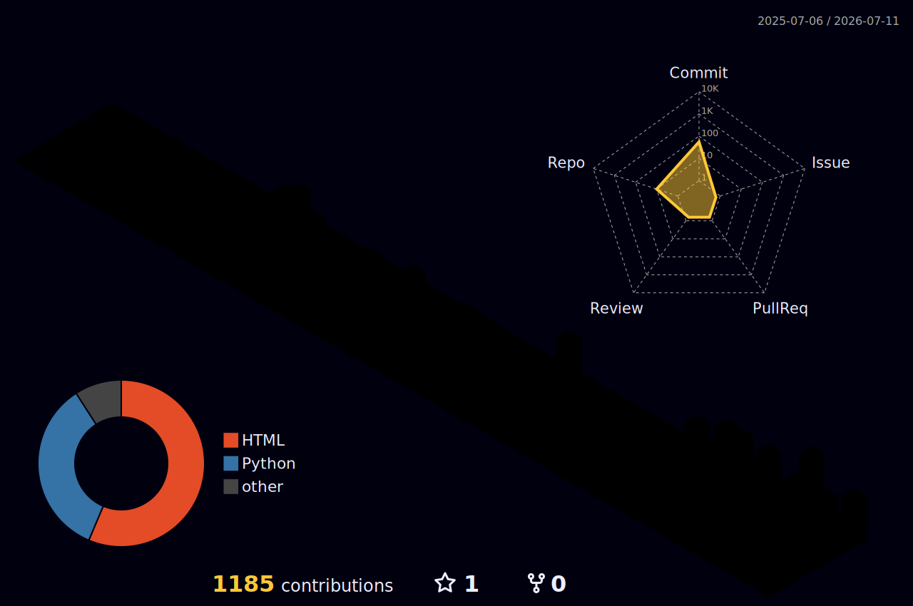

<!--
════════════════════════════════════════════════════════════════════════
  Amirali Mokri — GitHub Profile README
  Repo: github.com/amirmokri/amirmokri  (special profile repo)
  See SETUP.md for how to enable the snake + 3D graph workflows.
════════════════════════════════════════════════════════════════════════
-->

<!-- ╭──────────────────────────  HEADER BANNER  ──────────────────────────╮ -->
<a href="#">
  
</a>

<!-- ╭──────────────────────────  TYPING TAGLINE  ─────────────────────────╮ -->
<div align="center">

[](https://git.io/typing-svg)

<!-- ╭──────────────────────────  SOCIAL BADGES  ──────────────────────────╮ -->
<a href="https://linkedin.com/in/amirali-mokri"></a>
<a href="mailto:amirali.mokri@gmail.com"></a>


</div>

<!-- ╭──────────────────────────  ABOUT ME  ───────────────────────────────╮ -->
##  About Me


```python
class AmiraliMokri:
    def __init__(self):
        self.role       = "Python Developer · Django Specialist · AI Engineer"
        self.location   = "Karaj, Iran 🇮🇷"
        self.focus      = ["full-stack Django", "AI / ML", "data analytics & BI"]
        self.loves      = "complex problem-solving projects"
        self.motto      = "if it's hard, it's interesting"

    def current_stack(self):
        return ["Python", "Django", "DRF", "Selenium", "OpenCV", "PostgreSQL"]

    def say_hi(self):
        print("Open to collaboration — let's build something ambitious 🚀")
```

- 🔭 &nbsp;I build **full-stack Django apps** and **AI-powered tools** (image analysis, web automation, ranking intelligence)
- 📊 &nbsp;I design **data-analytics pipelines & BI dashboards** — SQL Server ETL, dimensional modeling, Metabase
- 🧠 &nbsp;I love **complex problem-solving** — the messier the problem, the better
- 🌱 &nbsp;Currently going deeper into **AI engineering & scalable backends**
- 💬 &nbsp;Ask me about **Django, Python automation, or computer-vision pipelines**

<br>

<!-- ╭──────────────────────────  TECH STACK  ─────────────────────────────╮ -->
##  Tech Stack

**Languages**


**Backend & AI**


**Data & Analytics**


**DevOps & Tools**


<br>

<!-- ╭──────────────────────────  GITHUB STATS  ───────────────────────────╮ -->
##  GitHub Stats

<div align="center">


</div>

<!-- ╭──────────────────────────  TROPHY CASE  ────────────────────────────╮ -->
##  Trophy Case

<div align="center">

[](https://github.com/ryo-ma/github-profile-trophy)

</div>

<!-- ╭─────────────────────  ACTIVITY GRAPH (flashy)  ─────────────────────╮ -->
##  Contribution Activity

<div align="center">

[](https://github.com/Ashutosh00710/github-readme-activity-graph)

</div>

<!-- ╭──────────────────────  3D CONTRIBUTION GRAPH  ──────────────────────╮ -->
##  3D Contribution Graph

<div align="center">



</div>

<!-- ╭──────────────────────────  SNAKE 🐍  ───────────────────────────────╮ -->
##  Watch My Contributions Get Eaten

<div align="center">

<picture>
  <source media="(prefers-color-scheme: dark)"  srcset="https://raw.githubusercontent.com/amirmokri/amirmokri/output/github-contribution-grid-snake-dark.svg" />
  <source media="(prefers-color-scheme: light)" srcset="https://raw.githubusercontent.com/amirmokri/amirmokri/output/github-contribution-grid-snake.svg" />
  
</picture>

</div>

<!-- ╭──────────────────────────  DEV QUOTE  ──────────────────────────────╮ -->
##  Dev Quote

<div align="center">


</div>

<!-- ╭──────────────────────────  FOOTER  ─────────────────────────────────╮ -->


<div align="center">
  <sub>⭐ From <a href="https://github.com/amirmokri">Amirali Mokri</a> — if you like my work, a follow means a lot.</sub>
</div>
